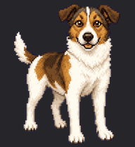
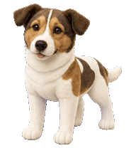
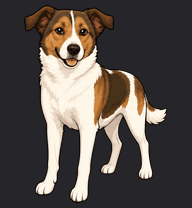
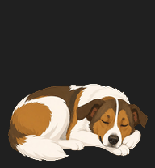
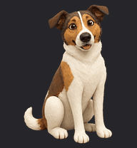
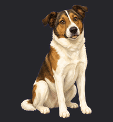

# Apollo Codex Pets

Apollo is my dog. I wanted to make him into a digital companion to keep me
company while I'm at the office, so here he is as an animated coding-agent
pet, in six art styles, for two hosts: the Codex CLI and
[Orca](https://onorca.dev).

The base art was generated from three photos via the
[openai/skills `hatch-pet` skill](https://github.com/openai/skills) and
`$imagegen`. The animations are cut from short Veo clips generated in
[Google Flow](https://labs.google/flow) from that art, then keyed,
loop-matched, and assembled by the scripts in `scripts/` — see
`prompts/full-prompts/video-pipeline.md` for the full recipe.

## Styles

Idle animation for each style (GIF previews in `docs/gifs/`). Clay,
flat-vector, and painterly show their video-pipeline loops — clay idles
asleep. Pixel, plush, and sticker still show the previous drawn-pose
animation until their video passes land:

| `pixel` | `plush` | `sticker` |
|:---:|:---:|:---:|
|  |  |  |

| `flat-vector` | `clay` | `painterly` |
|:---:|:---:|:---:|
|  |  |  |

## Layout

| Path | Contents |
|---|---|
| `photos/` | The three source photos of Apollo used for identity grounding |
| `refs/` | Same photos converted/resized to ≤1536px PNG for `$imagegen` |
| `variants/` | User-approved base look per style (full body on chroma green) + the 16:9 Flow start-frame refs derived from them |
| `runs/<style>-video/` | The Flow/Veo source clips per state and the 48-frame cell loops cut from them |
| `dist/codex-pets/` | Native Codex CLI pets: `pet.json` + 8×9 spritesheet |
| `dist/codex-pet-bundles/` | Orca-importable `.codex-pet` bundles, generated from `dist/codex-pets/` |
| `prompts/` | Generation prompts: per-style Flow video prompts, the pipeline recipe, and the original base-art runs (reproducibility) |
| `docs/gifs/` | Idle-animation GIF previews per style (used in this README) |
| `scripts/` | Post-processing generators (see below) |

## Installing

**Codex CLI** — copy a pet dir into place:

```bash
cp -R dist/codex-pets/apollo-plush ~/.codex/pets/
```

**Orca** — import a bundle via the status-bar pet menu → *Import .codex-pet*.

## The Orca bundles

Orca plays spritesheet pets with one flat fps, uniform `steps()` timing, and
only five of the nine animation rows: `idle`, `running` (working), `waiting`,
`review`, and `jumping` (a frozen frame while dragging). The bundles target
that reality: 48 columns @ 12fps, where each played state is a 4-second loop
of 48 real frames cut from a short Veo video (generated in Google Flow from
the style's `variants/` art on chroma green — see
`prompts/full-prompts/video-pipeline.md`), keyed, loop-matched, and anchored
to a common foot baseline so the pet stays planted. Rows Orca never plays
are carried over from the native pet's drawn poses. Built by
`scripts/orca-bundle.py`.

The two `dist/` dirs are one artifact per host, not duplicates: the native
Codex CLI pets in `dist/codex-pets/` are the source the bundle script reads
(each played row also carries 6 samples of its video loop for the CLI pet).
Bundles are regenerable from them in seconds; the reverse is not true, so
`dist/codex-pets/` is the dir to protect.

Orca manifest limits (from its import validator): ≤512 frames per animation
(and ≤ sheet columns), fps ≤ 60, frame ≤ 1024px per side, sheet ≤ 64MB,
sheet dimensions must be clean multiples of the frame size. WebP itself caps
dimensions at 16383px → 85 columns max at 192px cells.

## Scripts

```bash
# 16:9 green-screen start frame for Flow from a style's variant art
python scripts/video_ref.py variants/apollo-clay.png variants/apollo-clay-video-ref-16x9.png

# cut a downloaded Flow/Veo clip into a 48-frame loop of placed cells
python scripts/video_rows.py runs/clay-video/idle.mp4 runs/clay-video/cells/idle \
  --gif qa/clay-video-idle.gif

# author every cut state into the pet, render previews, rebuild the bundle
python scripts/author_video_rows.py clay

# preview exactly what Orca will play, without building anything
python scripts/orca-bundle.py --preview dist/codex-pets/apollo-clay qa/preview

# build a 48-column Orca bundle from a native codex pet
python scripts/orca-bundle.py dist/codex-pets/apollo-clay out/Apollo-clay.codex-pet
```

Saves WebP with `lossless=True, exact=True` — without `exact`, libwebp
rewrites RGB under fully-transparent pixels and the hatch-pet validator
rejects the sheet.

## Animating a style (the video pipeline)

Follow `prompts/full-prompts/video-pipeline.md`: generate one 8-second clip
per state in Google Flow (start frame = the style's
`variants/apollo-<style>-video-ref-16x9.png`, End frame = same image except
for running; prompts in `prompts/full-prompts/<style>-video-states.md`),
drop the MP4s at `runs/<style>-video/<state>.mp4`, cut with
`scripts/video_rows.py`, then `scripts/author_video_rows.py <style>`.

## Regenerating a style from scratch

1. Generate/approve a base look with `prompts/variant-prompt.md`.
2. Build the native pet (the 8×9 drawn-pose spritesheet) with the style's
   original full-run prompt in `prompts/full-prompts/<style>.md`:
   `codex exec --skip-git-repo-check -s workspace-write - < prompt.md`.
   The codex sandbox can't write `~/.codex/pets` — copy the staged package
   in manually.
3. Animate it with the video pipeline above (refs via `scripts/video_ref.py`,
   prompts via a new `prompts/full-prompts/<style>-video-states.md`).
